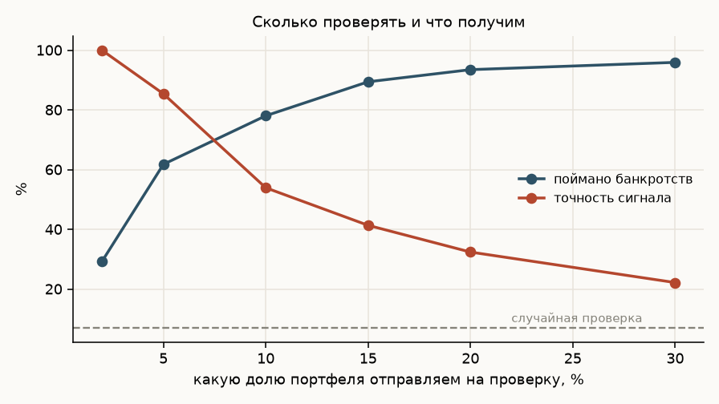
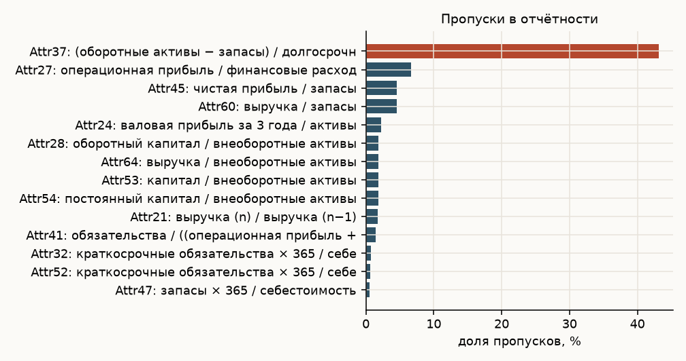
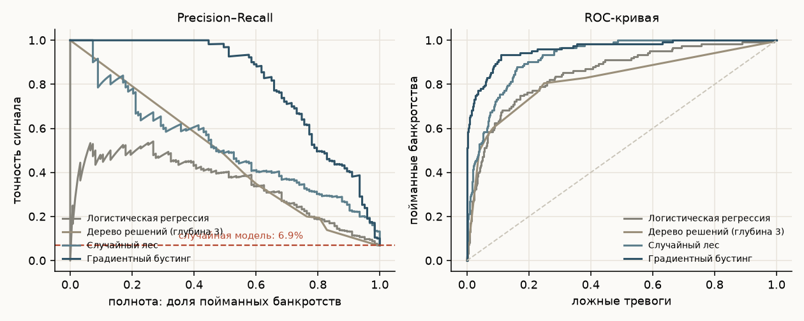
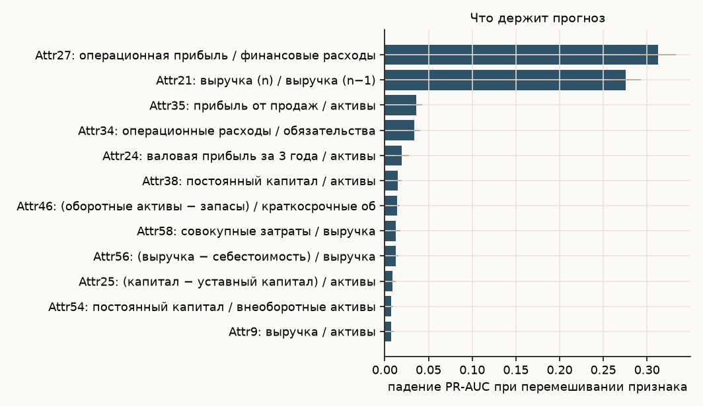
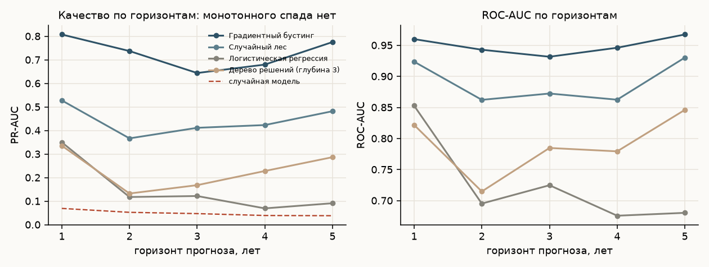

# Прогноз банкротства компаний: деревья против логистической регрессии

Корпоративный кредитный риск на открытых данных: 64 финансовых коэффициента,
43 405 наблюдений по польским компаниям, горизонты от года до пяти лет.
Задача сильно несбалансированная — банкротится от 3,9 % до 6,9 % выборки.

**Результат:** на горизонте в один год градиентный бустинг даёт PR-AUC 0,81 при
случайном уровне 0,069 — в двенадцать раз выше базы. Проверяя 5 % портфеля,
находим 62 % будущих банкротств.



## Почему не accuracy

При доле банкротств 6,9 % модель, которая всем говорит «выживет», права в 93 %
случаев и бесполезна. Поэтому главная метрика — **PR-AUC**, площадь под кривой
точность-полнота, и её всегда сравниваем с базой, равной доле событий.
ROC-AUC приводится как привычный ориентир, но на несбалансированных данных
он выглядит оптимистичнее, чем есть на самом деле.

## Данные

UCI «Polish companies bankruptcy data»: пять файлов, по одному на год наблюдения.
Горизонт прогноза в них **обратный** — в файле `1year` коэффициенты первого года,
а метка означает банкротство через пять лет; в `5year` — данные последнего года и
банкротство через год.

| Файл | Компаний | Банкротств | Горизонт |
|---|---|---|---|
| 1year | 7 027 | 271 (3,9 %) | 5 лет |
| 2year | 10 173 | 400 (3,9 %) | 4 года |
| 3year | 10 503 | 495 (4,7 %) | 3 года |
| 4year | 9 792 | 515 (5,3 %) | 2 года |
| 5year | 5 910 | 410 (6,9 %) | 1 год |

Пропуски есть в 49 признаках из 64, худший — `Attr37` (оборотные активы минус
запасы к долгосрочным обязательствам), 43 % пропусков: у компании просто может
не быть долгосрочного долга. Логистическая регрессия и деревья получают медианное
заполнение, градиентный бустинг работает с пропусками напрямую.



## Результаты, горизонт один год

| Модель | ROC-AUC | Gini | PR-AUC | KS | Brier | PR-AUC на 5-fold CV |
|---|---|---|---|---|---|---|
| Градиентный бустинг | **0,960** | **0,920** | **0,808** | **0,825** | **0,028** | 0,789 |
| Случайный лес | 0,924 | 0,847 | 0,528 | 0,717 | 0,050 | 0,490 |
| Логистическая регрессия | 0,853 | 0,706 | 0,350 | 0,577 | 0,160 | 0,328 |
| Дерево решений, глубина 3 | 0,822 | 0,644 | 0,336 | 0,556 | 0,143 | 0,284 |

Случайный уровень PR-AUC — 0,069.



Разрыв между бустингом и логистической регрессией огромный — 0,81 против 0,35
по PR-AUC. Это не тот случай, что был в скоринге физлиц, где разница измерялась
сотыми. Причина в природе данных: связи между коэффициентами нелинейные и
взаимозависимые — высокий долг опасен при слабой ликвидности и терпим при сильной,
а линейная модель такое выразить не может.

## Что важно для прогноза



| Коэффициент | Смысл | Падение PR-AUC |
|---|---|---|
| `Attr27` | операционная прибыль / финансовые расходы | 0,313 |
| `Attr21` | выручка (n) / выручка (n−1) | 0,275 |
| `Attr35` | прибыль от продаж / активы | 0,036 |
| `Attr34` | операционные расходы / обязательства | 0,034 |
| `Attr24` | валовая прибыль за 3 года / активы | 0,020 |

Два признака решают почти всё, и оба понятны без модели: покрытие процентов
операционной прибылью и динамика выручки. Компания, которая не зарабатывает на
обслуживание долга и теряет продажи, — классический кандидат в дефолт.

## Дерево как кредитная политика

Неглубокое дерево превращается в набор правил, который помещается на страницу:

```
прибыль от продаж / активы <= -0.029
├── оборотный капитал <= 619.7 ..................... тревога
└── оборотный капитал > 619.7
    └── обязательства / (операционная прибыль + аморт.) <= 0.034 .... тревога
прибыль от продаж / активы > -0.029
├── постоянный капитал / активы <= 0.528
│   └── операционная прибыль / фин. расходы > 0.972 ... тревога
└── постоянный капитал / активы > 0.528
    └── (капитал − уставный капитал) / активы <= -0.008 ... тревога
```

Цена простоты честная: PR-AUC падает с 0,81 до 0,34. То есть правила годятся как
первичный фильтр или как объяснение логики комитету, но заменять ими модель —
значит пропустить половину проблемных компаний.

## Горизонт прогноза



Ожидание было простое: чем дальше горизонт, тем хуже прогноз. Данные этого не
подтверждают — PR-AUC падает с 0,81 (год) до 0,64 (три года), а затем снова растёт
до 0,78 на пятилетнем горизонте. Объяснение не в том, что предсказывать на пять лет
легче: пять файлов — это **разные выборки компаний**, а не одни и те же фирмы,
прослеженные во времени. Сравнивать горизонты между собой напрямую нельзя, и
честный вывод здесь — отрицательный: датасет не позволяет измерить, как качество
зависит от горизонта.

## Сколько проверять

| Доля портфеля на проверку | Поймано банкротств | Точность сигнала | Ложных тревог на одно банкротство |
|---|---|---|---|
| 2 % | 29,3 % | 100 % | 0,0 |
| 5 % | 61,8 % | 85,4 % | 0,2 |
| 10 % | 78,0 % | 53,9 % | 0,9 |
| 15 % | 89,4 % | 41,4 % | 1,4 |
| 20 % | 93,5 % | 32,4 % | 2,1 |

Так модель превращается в рабочий инструмент: не «вероятность 0,37», а решение,
сколько компаний кредитный аналитик успевает разобрать руками.

## Воспроизведение

```bash
python3 -m venv .venv && .venv/bin/pip install -r requirements.txt
.venv/bin/python src/01_download.py   # данные UCI
.venv/bin/python src/02_models.py     # четыре модели на пяти горизонтах
.venv/bin/python src/03_analysis.py   # важность, правила дерева, пороги
.venv/bin/python src/04_charts.py     # графики
```

## Оговорки

Отчётность за год до банкротства уже содержит явные признаки бедствия, поэтому
высокие метрики на горизонте в год не стоит переносить на задачу раннего
предупреждения. Данные польские, 2000–2013 годы: переносится методика, а не
коэффициенты. Валидации на более позднем периоде нет — выборка не панельная.
