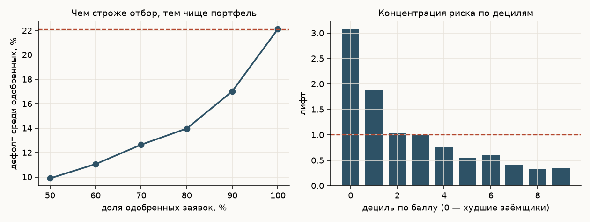
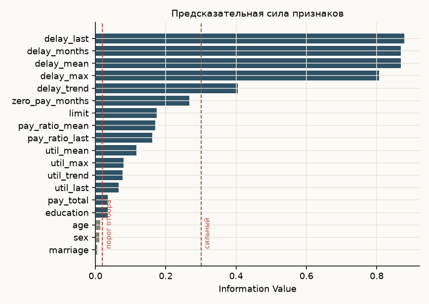
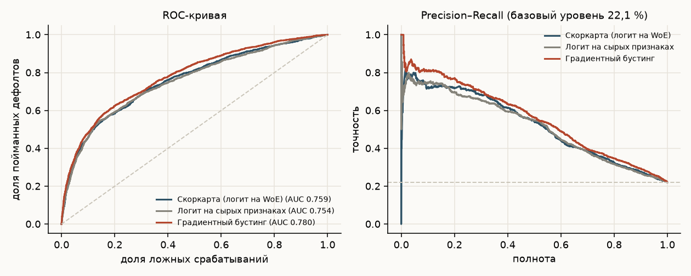
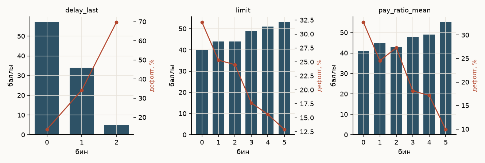
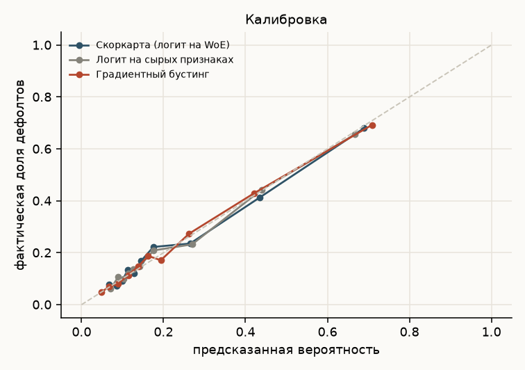

# Кредитный скоринг: скоркарта против градиентного бустинга

Полный цикл построения скоринговой модели на открытых данных: от сырых выписок
по картам до скоркарты в баллах и расчёта, сколько банк выигрывает на отборе.

**Результат:** Gini 0,52 у интерпретируемой скоркарты против 0,56 у градиентного
бустинга. При одобрении 70 % заявок дефолт в портфеле падает с 22,1 % до 12,7 %,
а отсекается 60 % будущих дефолтов.



## Данные

UCI «Default of credit card clients» — 30 000 заёмщиков тайваньского банка, 2005 год.
Шесть месяцев истории: статус платежей, выставленные счета, фактические погашения,
кредитный лимит и демография. Целевая переменная — выход в дефолт в следующем месяце,
доля дефолтов 22,1 %. Загружается скриптом, регистрация не нужна.

## Признаки

Исходные колонки непригодны напрямую: `PAY_0 … PAY_6` — это коды состояния, а счета
и платежи не сопоставимы между клиентами с разными лимитами. Поэтому построены
18 признаков в трёх группах, по логике кредитного аналитика:

| Группа | Признаки | Смысл |
|---|---|---|
| Просрочки | `delay_max`, `delay_last`, `delay_months`, `delay_mean`, `delay_trend` | глубина, свежесть, частота и динамика просрочки |
| Использование лимита | `util_last`, `util_mean`, `util_max`, `util_trend` | насколько клиент выбрал лимит и куда это движется |
| Дисциплина погашения | `pay_ratio_mean`, `pay_ratio_last`, `zero_pay_months`, `pay_total` | какую долю счёта клиент реально гасит |

Отдельно — лимит, возраст, пол, образование, семейное положение.

## Отбор признаков

Для каждого признака построен WoE-биннинг и посчитан Information Value — стандартная
практика кредитного скоринга. Биннинг настраивается только на обучающей выборке.



| Признак | IV | Сила |
|---|---|---|
| `delay_last` | 0,878 | очень сильный |
| `delay_months` | 0,869 | очень сильный |
| `delay_max` | 0,807 | очень сильный |
| `delay_trend` | 0,405 | сильный |
| `zero_pay_months` | 0,267 | средний |
| `limit` | 0,174 | средний |
| `pay_ratio_mean` | 0,170 | средний |
| `util_mean` | 0,116 | средний |
| `education` | 0,035 | слабый |
| `age` | 0,014 | бесполезный |
| `sex` | 0,010 | бесполезный |
| `marriage` | 0,005 | бесполезный |

Из 18 признаков в модель попали 12: отсеяны слабые по IV и те, что дублируют
друг друга при корреляции выше 0,8 — из группы просрочек осталось три признака
вместо пяти.

## Модели

| Модель | AUC | Gini | KS | PR-AUC | Brier | AUC на 5-fold CV |
|---|---|---|---|---|---|---|
| Скоркарта (логит на WoE) | 0,759 | 0,518 | 0,395 | 0,522 | 0,139 | 0,771 ± 0,010 |
| Логит на сырых признаках | 0,754 | 0,509 | 0,403 | 0,516 | 0,140 | 0,766 ± 0,012 |
| Градиентный бустинг | **0,780** | **0,559** | **0,426** | **0,557** | **0,135** | 0,787 ± 0,009 |

Отложенная выборка — 9000 заёмщиков, стратифицированное разбиение 70/30.



## Скоркарта

Коэффициенты логистической регрессии переведены в баллы по стандартной схеме:
PDO = 20, базовый балл 600 при шансах 20:1. Итог — таблица из 60 строк: признак,
интервал значений, баллы. Такую карту можно отдать в кредитный комитет и объяснить
каждое решение.



## Сколько это стоит в деньгах

| Одобряем заявок | Порог балла | Дефолт среди одобренных | Отсечено будущих дефолтов |
|---|---|---|---|
| 50 % | 567 | 9,9 % | 77,6 % |
| 60 % | 562 | 11,1 % | 70,0 % |
| 70 % | 553 | 12,7 % | 60,0 % |
| 80 % | 533 | 14,0 % | 49,5 % |
| 90 % | 508 | 17,0 % | 30,7 % |
| 100 % | 465 | 22,1 % | 0 % |

В худшем дециле по баллу дефолтит 68 % заёмщиков, в лучшем — 7,7 %. Лифт худшего
дециля 3,07: модель концентрирует риск там, где он и должен быть.

## Выводы

1. **Платёжная дисциплина решает всё.** Четыре признака просрочки имеют IV выше 0,8,
   это уровень «очень сильный». Всё остальное — добавка.
2. **Демография бесполезна.** Пол, возраст и семейное положение имеют IV ниже 0,02.
   Это и к лучшему: по таким признакам кредитовать юридически рискованно, а модель
   ничего не теряет без них.
3. **Бустинг выигрывает четыре пункта Gini** — это реальная, но не драматичная разница.
   Для розничного портфеля вопрос ставится так: стоят ли 0,04 Gini потери
   интерпретируемости и объяснимости перед регулятором. Для первой модели — нет.
4. **Калибровка важнее ранжирования, если считать деньги.** Brier у всех трёх моделей
   близок, а вот на калибровочной кривой логит ведёт себя ровнее бустинга в середине
   шкалы — там, где принимаются пограничные решения.



## Воспроизведение

```bash
python3 -m venv .venv && .venv/bin/pip install -r requirements.txt
.venv/bin/python src/01_download.py   # скачать данные UCI
.venv/bin/python src/02_features.py   # построить признаки
.venv/bin/python src/03_woe.py        # WoE-биннинг и IV
.venv/bin/python src/04_models.py     # обучение, метрики, скоркарта
.venv/bin/python src/05_charts.py     # графики
```

## Оговорки

Данные 2005 года и одного рынка — переносить коэффициенты на другой портфель нельзя,
переносится методика. Выборка одномоментная, поэтому out-of-time валидации нет:
на реальном портфеле модель обязательно проверяется на более позднем периоде.
Макроэкономический цикл в данных не отражён.
