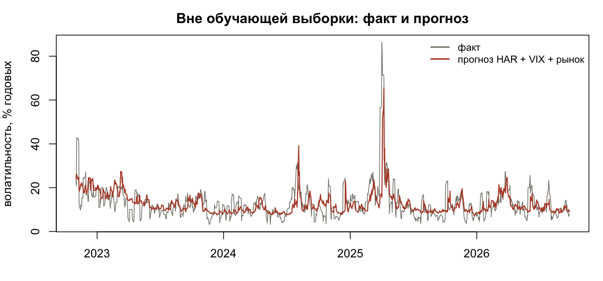
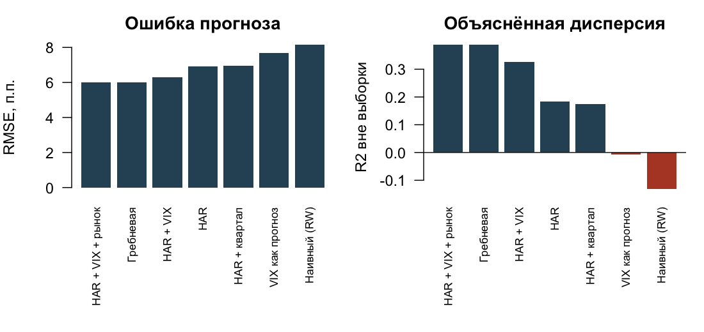

# Прогноз волатильности S&P 500: HAR-регрессия против VIX

Классическая задача риск-аналитики: предсказать, насколько сильно рынок будет
колебаться в ближайшую неделю. Линейная регрессия на правильно построенных
признаках обыгрывает и наивный прогноз, и сам VIX.

**Результат:** R² вне обучающей выборки **0,39** против −0,13 у наивного прогноза
и −0,01 у VIX. Преимущество статистически значимо, тест Диболда–Мариано даёт
p = 0,005.



## Задача

Целевая переменная — реализованная волатильность S&P 500 на горизонте
**5 торговых дней вперёд**, в годовом выражении:

    RV[t+1:t+5] = sqrt(252/5 * сумма квадратов дневных лог-доходностей)

Прогноз строится на момент t, в признаки попадает только то, что к этому моменту
уже известно.

## Данные

Всё с FRED, без ключей и регистрации: `R/01_download.R` скачивает четыре ряда.

| Ряд | Что это | Зачем |
|---|---|---|
| `SP500` | индекс S&P 500, дневной | источник доходностей и целевой переменной |
| `VIXCLS` | VIX | подразумеваемая волатильность — ожидания рынка |
| `DGS10`, `DGS2` | доходности облигаций 10 и 2 лет | наклон кривой как индикатор цикла |

Итоговая панель: **2443 наблюдения**, 06.01.2017 — 25.09.2026.

## Признаки

| Признак | Формула | Смысл |
|---|---|---|
| `rv1` | √252 · \|r_t\| | вчерашнее движение |
| `rv5`, `rv22`, `rv66` | реализованная волатильность за 5, 22, 66 дней | каскад горизонтов из модели HAR |
| `ivol` | VIX / 100 | чего ждёт рынок опционов |
| `term` | DGS10 − DGS2 | наклон кривой доходности |
| `ret5` | сумма доходностей за 5 дней | эффект рычага: падения поднимают волатильность |

Волатильность логнормальна, поэтому регрессия строится в логарифмах; прогноз
возвращается в уровни экспонентой.

## Валидация

Честная проверка вперёд по времени, без подглядывания:

- первые 60 % выборки (до 31.10.2022) используются только для обучения;
- расширяющееся окно, переобучение каждые 21 торговый день;
- между концом обучающей выборки и прогнозируемой датой оставлен разрыв в 5 дней,
  иначе целевая переменная частично попала бы в обучение;
- вне выборки — **978 дней**, 01.11.2022 — 25.09.2026.

## Результаты

| Модель | RMSE | MAE | R² вне выборки | QLIKE |
|---|---|---|---|---|
| HAR + VIX + рынок | 6,00 п.п. | 3,76 п.п. | **0,388** | 0,344 |
| Гребневая регрессия | 6,00 п.п. | 3,77 п.п. | 0,388 | 0,339 |
| HAR + VIX | 6,30 п.п. | 3,88 п.п. | 0,325 | 0,405 |
| HAR | 6,93 п.п. | 4,28 п.п. | 0,183 | 0,491 |
| VIX как прогноз | 7,69 п.п. | 6,09 п.п. | −0,006 | 0,417 |
| Наивный (прошлая неделя) | 8,16 п.п. | 5,22 п.п. | −0,131 | 0,806 |



Тест Диболда–Мариано против наивного прогноза (с поправкой Ньюи–Уэста на
перекрытие окон): HAR + VIX + рынок — p = 0,005; HAR + VIX — p = 0,011;
чистый HAR — p = 0,068; VIX сам по себе — p = 0,50.

Коэффициенты финальной модели (R² внутри выборки 0,56):

| Признак | Коэффициент | t |
|---|---|---|
| log VIX | 1,162 | 21,4 |
| наклон кривой | −0,177 | −10,8 |
| доходность за 5 дней | −3,199 | −7,9 |
| log RV за 5 дней | 0,059 | 2,4 |
| log RV за 22 дня | 0,049 | 1,4 |
| log RV за 1 день | −0,010 | −1,3 |

## Выводы

1. **VIX — сильнейший признак, но сам по себе он плохой прогноз.** Коэффициент 1,16
   при логарифме VIX и значимость 21 сигма, однако как готовый прогноз VIX даёт
   R² около нуля: он систематически завышает будущую волатильность — премия за риск.
   Ценность появляется, когда модель корректирует его уровень.
2. **Эффект рычага заметен.** Коэффициент при доходности за неделю −3,2: падение
   рынка на 1 % поднимает прогноз волатильности примерно на 3 %.
3. **Наклон кривой доходности работает** как индикатор режима: плоская и
   перевёрнутая кривая сопровождается более высокой будущей волатильностью.
4. **Регуляризация ничего не добавила.** Гребневая регрессия с λ = 10 повторила
   результат обычного МНК: признаков мало и они осмысленны, переобучения нет.
5. **Наивный прогноз хуже среднего** (R² = −0,13). Волатильность возвращается к
   среднему достаточно быстро, чтобы «как было вчера» проигрывало даже константе.

Что прогноз не умеет: ловить пик. На всплеске апреля 2025 года факт доходил до 86 %
годовых, модель дала около 65 %. Это ограничение линейной модели в логарифмах, и
для стресс-тестов её стоит дополнять сценарным подходом.

## Воспроизведение

```bash
Rscript R/01_download.R    # скачать данные с FRED
Rscript R/02_features.R    # собрать панель признаков
Rscript R/03_models.R      # обучение, валидация, метрики
Rscript R/04_charts.R      # графики в outputs/
```

Нужен только базовый R, сторонних пакетов нет. Полный прогон занимает меньше минуты.

## Структура

    R/01_download.R    загрузка рядов с FRED
    R/02_features.R    признаки и целевая переменная
    R/03_models.R      модели, валидация вперёд по времени, метрики, тест Диболда–Мариано
    R/04_charts.R      графики
    outputs/           графики, метрики, прогнозы
    data/              исходные CSV и собранная панель

## Оговорки

Окна целевой переменной перекрываются, поэтому ошибки автокоррелированы — в тесте
Диболда–Мариано используется оценка дисперсии Ньюи–Уэста. Реализованная волатильность
считается по дневным закрытиям, а не по внутридневным данным, то есть это
приближение. Период включает всего один по-настоящему турбулентный эпизод, и оценки
качества на нём неустойчивы.
